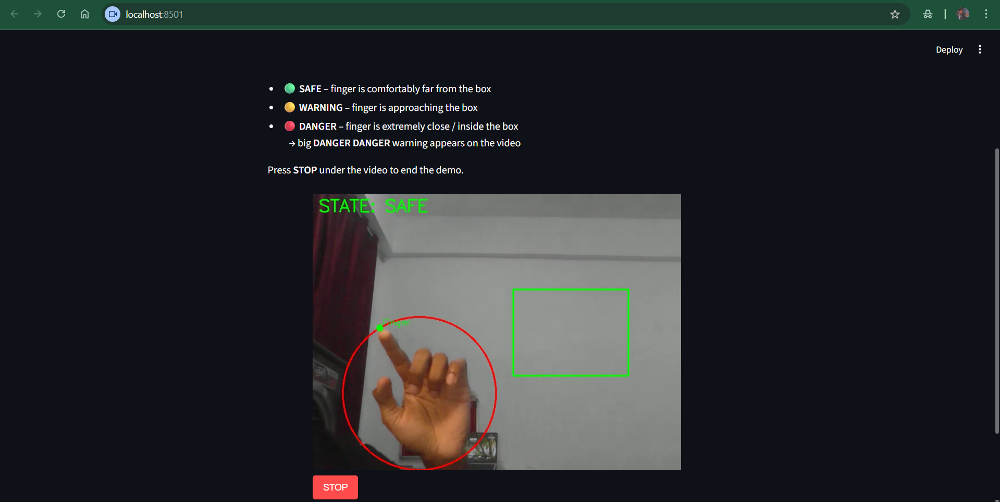

## Streamlit UI Preview



# Hand Boundary POC – Real‑Time Finger vs Virtual Danger Zone

This project is a small end‑to‑end prototype that shows how to:

- Track a **real hand / fingertip** in real time  
- Draw a **virtual object** (a box) on top of the camera feed  
- Detect when the finger is **far / near / touching** that virtual boundary  
- Run the whole thing **on CPU**, using only classic computer vision (no MediaPipe, no OpenPose)

It’s implemented twice:

- As a plain **OpenCV desktop app** (Python script with pop‑up windows)
- As a **Streamlit web app** using `streamlit-webrtc` (runs in your browser)

---

## 1. What this prototype does

Conceptually, imagine a virtual safety zone on the screen.  
Your camera shows your real hand. As you move a finger towards the box:

- When your finger is **far** → the system shows `SAFE`
- When your finger gets **close** → it turns to `WARNING`
- When your finger is **very close / touching** the box → it screams `DANGER DANGER` directly on the live video

This demonstrates:

- Hand/finger tracking without any pose API
- Geometry-based interaction with virtual objects
- A simple but working **distance-based state machine**

---

## 2. Tech stack

- **Language:** Python
- **Computer vision:** OpenCV, NumPy
- **Web UI:** Streamlit, streamlit‑webrtc, av
- **Hardware:** Any webcam, CPU only

No cloud services, no heavy models.

---

## 3. Project structure

```text
hand_boundary_poc/
├─ README.md
├─ requirements.txt
├─ streamlit_app.py           # Streamlit + WebRTC UI
└─ src/
   ├─ __init__.py
   ├─ config.py               # HSV ranges, rectangle size, thresholds
   ├─ hand_tracking.py        # Skin-based hand + fingertip detection
   ├─ virtual_boundary.py     # Virtual box + distance + state logic
   └─ main.py                 # OpenCV desktop demo (windows)


# 1. (Recommended) create a virtual environment
python -m venv .venv
# Windows
.\.venv\Scripts\activate
# macOS / Linux
source .venv/bin/activate

# 2. Install dependencies
pip install -r requirements.txt